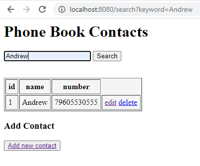
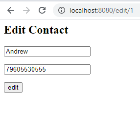
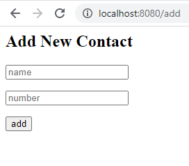
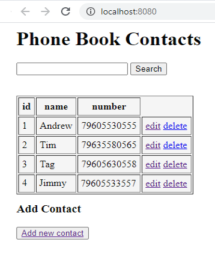

<h2>CRUD Phone Book</h2>
CRUD application is done using Maven, Spring, MySQL, Hibernate 
General view of the application:  

Implementation of search by contacts, for example, Name:  

 
Example of editing a contact from the list:  
 
Adding a new contact to the list:  
 
Delete the last contact in the list, when pressed "delete":  

 
<h3>The commands to create the database to use are stored in the sql folder.</h3>
