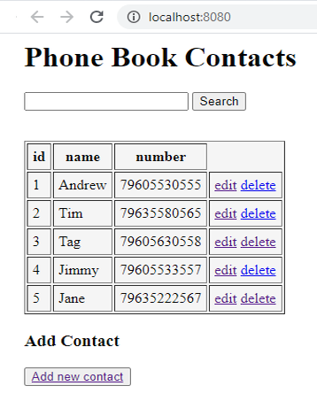

<h4>CRUD Phone Book</h4>
CRUD application is done using Maven, Spring, MySQL, Hibernate 
 
General view of the application:

Implementation of search by contacts, for example, Name:
.png?raw=true)
Example of editing a contact from the list:
.png?raw=true)
Adding a new contact to the list:
.png?raw=true)
Delete the last contact in the list, when pressed "delete":
.png?raw=true)
 
the commands to create the database to use are stored in the sql folder.
